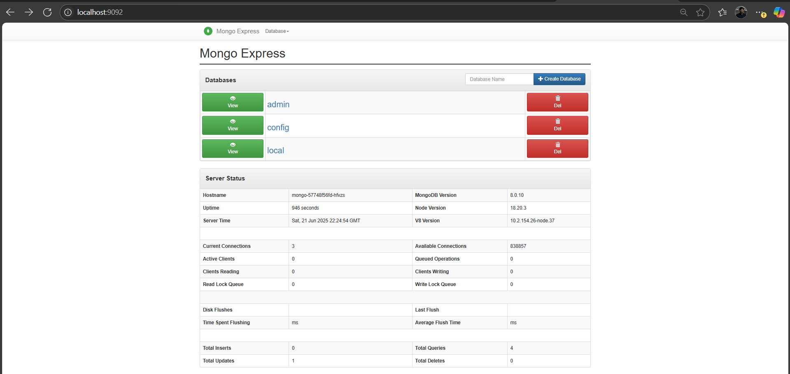

# Assignment 1 : MongoDB with Mongo Express on Kubernetes - Summary

### Objective

It included "mongo" as the backend database and "mongo-express" as the frontend UI to interact with it. 
Kubernetes resources used : Secrets (for storing credentials), and ConfigMaps (for non-sensitive config).
.  
<br>


---

### I faced few issues: 
- 1st : Mongo Express was unable to connect to MongoDB due to an incorrect hostname (mongo) in the ME_CONFIG_MONGODB_SERVER environment variable. This was fixed by pointing it to the correct service name mongo-service. 
- 2nd : While the credentials were correctly passed from the Secret, we initially assumed ME_CONFIG_BASICAUTH was required, which caused login confusion on the UI — especially because basic authentication (Basic Auth) was disabled by default, but Mongo Express still required DB credentials. 
- 3rd : There was a bit of confusion around port forwarding; we expected it to run directly on port 8081, but had to map it manually to a different host port like 9091 using kubectl port-forward, since 8081 was already used (By the Jenkins Assignment , i did in month one internship training ). 
Once these were fixed, everything worked correctly.
---

## Steps : 

#### 1: Describing secret and ConfigMap in YAML file

---
#### 2: Deploy MongoDB using a Deployment and Service

---
<!-- #### 3: Create a ConfigMap for Non-Sensitive Data

--- -->
#### 4: Deploy Mongo-Express using Deployment and Service

---
#### 5: Website - Output
- 5.1 : Getting service URL trrough port forwarding
    - 
    ```
    kubectl get pods -l app=mongo-express

    kubectl port-forward pod/mongo-express-789fd7f8c6-d5795 9091:8081
    ```
- 5.2 : Login & Test -> http://localhost:9092/
    - username : priyeshrai
    - password : mongopass
    

---


---

#### 6: Cleanup
 - ```
    kubectl delete -f mongo-express-deployment.yaml
    kubectl delete -f mongo-express-service.yaml
    kubectl delete -f mongo-deployment.yaml
    kubectl delete -f mongo-service.yaml
    kubectl delete -f mongo-configmap.yaml
    kubectl delete -f mongo-secret.yaml
    ``` 

---

