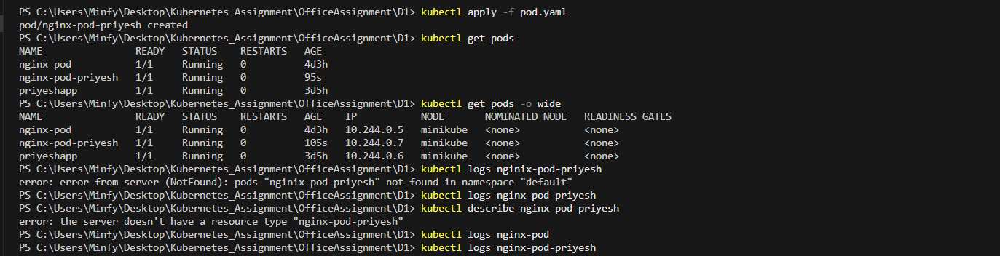

<!-- ✅ Step-by-Step Assignment (as given):
✅ Step 1: Create the Pod YAML
You've already created this:

yaml
Copy
Edit
apiVersion: v1
kind: Pod
metadata:
  name: nginx-pod
  labels:
    app: nginx
spec:
  containers:
  - name: nginx-container
    image: nginx:1.14.2
    ports:
    - containerPort: 80
✅ Saved as: pod.yaml

✅ Step 2: Apply Manifest
In your VS Code terminal:

bash
Copy
Edit
cd Kubernetes_Assignment/OfficeAssignment/D1
kubectl apply -f pod.yaml
Expected Output:

bash
Copy
Edit
pod/nginx-pod created
✅ Step 3: Inspect the Pod
Check status:

bash
Copy
Edit
kubectl get pods
Check wide details:

bash
Copy
Edit
kubectl get pods -o wide
View logs:

bash
Copy
Edit
kubectl logs nginx-pod
Describe pod (for debugging):

bash
Copy
Edit
kubectl describe pod nginx-pod -->


<!--  -->

# Assignment D1: Deploying NGINX Pod on Kubernetes – Summary

### Objective

Deploy a simple NGINX web server using a Kubernetes Pod definition file. This helped in understanding how individual containers run inside pods.

---

### I faced a few issues:

- Initially typed `nginix` instead of `nginx` when checking logs, which led to "pod not found" errors.
- Learned the importance of precise naming and spelling in `kubectl` commands.

---

## Steps Followed

```bash
kubectl apply -f pod.yaml
kubectl get pods
kubectl logs nginx-pod-priyesh
kubectl describe pod nginx-pod-priyesh
```

---

### Screenshots

>   
>   
> 

---

### Output Samples

```
pod/nginx-pod-priyesh created

NAME                READY   STATUS    RESTARTS   AGE
nginx-pod-priyesh   1/1     Running   0          2m
```

---

